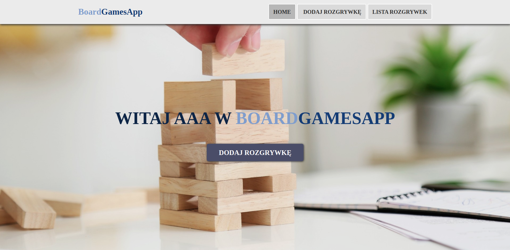
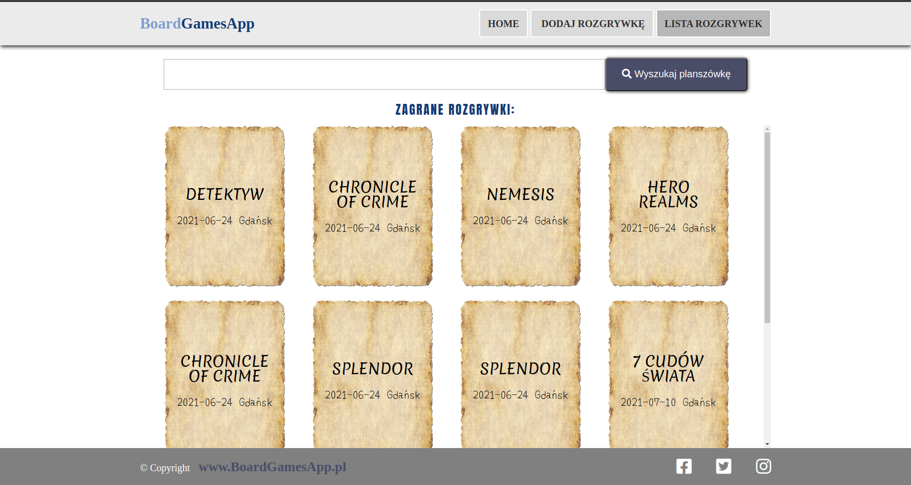
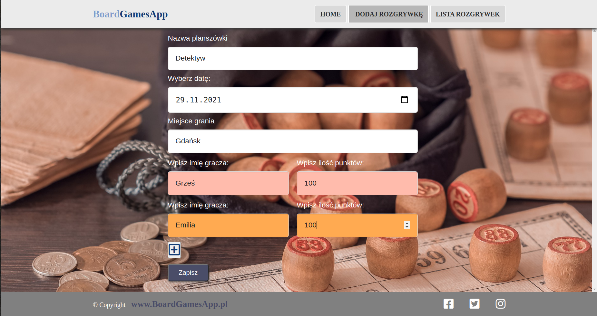

# BoardGamesApp
Thesis from the Coders Lab bootcamp.

## General Information
The project is used to save the games of boardgames.

## Technologies Used
- React 16.11
- React Router 5.2
- Babel 7.5
- REST API 3.6
- JSON Server 0.16.3
- SASS 1.34
- GRID 
- Webpack 4.39

## Screenshots

## Setup
- npm install --dev
- json-server --watch database/db.json
- npm start

## Contact
emilia.parzych92@gmail.com - feel free to contact me!
